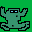
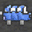

# Frogger-Juego
Josue Alejandro Gómez Soltero 22310230
###
José de Jesús Delgadillo Leal 22310205

## Resumen
El objetivo del juego es guiar una rana hasta su hogar. Para hacerlo, la rana debe evitar coches mientras cruza una carretera congestionada.
## Caracteristicas
### Rana

###
Es el personaje principal del juego. Una rana que puede moverse en un plano 2D ya sea hacia arriba, abajo, izquierda o derecha

### Carros

####
Los carros son el obstaculo principal para la rana. Se mantienen estaticos en la avenida.

## Mapa

###
El mapa está formado por una zona de arboles (principalmente como decoracion), pasto, la avenida de concreto, y nuestra meta. 

## Diagrama

### Creditos
Se utilizo como motor el programa https://github.com/JaydenHammond/Proyecto/